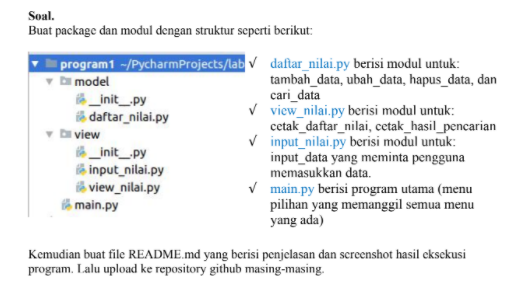
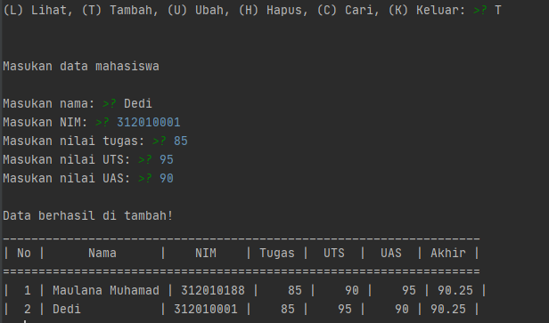
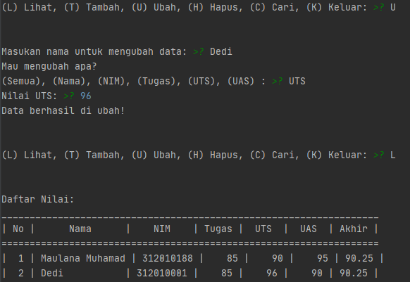
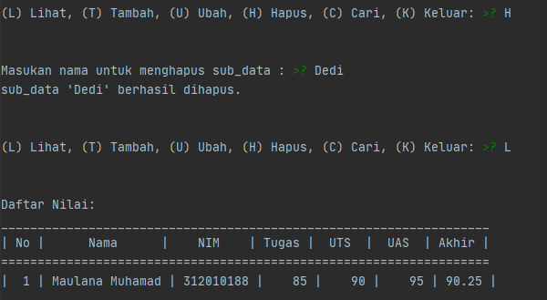
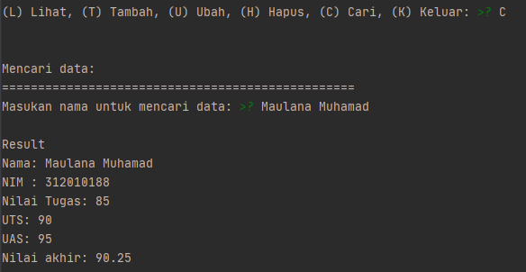
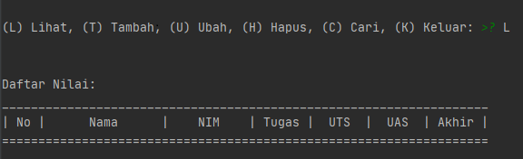

Repository ini dibuat untuk memenuhi Nilai UAS - Bahasa Pemrograman.
<hr>
Nama    : Maulana Muhamad <br>

NIM     : 312010188 <br>

Kelas   : TI.20. A.1 <br>
<hr>

## UAS
   

   <hr>

## SOAL 1
 Pada soal pertama diminta untuk membuat modul yang diantaranya adalah Tambah Data, Ubah Data, Hapus Data, Dan Cari Data. 

 ### syntax dibawah berfungsi untuk menambahkan data :

```python
      elif menu.lower() == 't':
        print("Masukan data mahasiswa")
        print("...")
        nama = input("Masukan nama: ")
        nim = input("Masukan NIM: ")
        nilai_tugas = int(input("Masukan nilai tugas: "))
        nilai_uts = int(input("Masukan nilai UTS: "))
        nilai_uas = int(input("Masukan nilai UAS: "))
        nilai_akhir = (nilai_tugas)*30/100 + (nilai_uts)*35/100 + (nilai_uas)*35/100
        data[nama] = [nama, nim, nilai_tugas, nilai_uts, nilai_uas, nilai_akhir]
        print('\nData berhasil di tambah!')
        print("___________________________________________________________________")
        print("| No |      Nama      |    NIM    | Tugas |  UTS  |  UAS  | Akhir |")
        print("===================================================================")
        no = 1
        for tabel in data.values():
            print("| {0:2} | {1:14} | {2:9} | {3:5} | {4:5} | {5:5} | {6:5} |".format
                  (no, tabel[0],
                   tabel[1], tabel[2],
                   tabel[3], tabel[4], tabel[5]))
            no += 1
            print("===================================================================")
```

> jika syntax diatas dirun yang nantinya berfungsi sepeti dibawah ini, masukan 
"T" untuk Menambah Data.


### syntax dibawah berfungsi untuk mengubah data :

```python
        elif menu.lower() == 'u':
        nama = input("Masukan nama untuk mengubah data: ")
        if nama in data.keys():
            print("Mau mengubah apa?")
            sub_data = input("(Semua), (Nama), (NIM), "
                         "(Tugas), (UTS), (UAS) : ")
            if sub_data.lower() == "semua":
                print("==========================")
                print("Ubah data {}.".format(nama))
                print("==========================")
                data[nama][1] = input("Ubah NIM:")
                data[nama][2] = int(input("Ubah Nilai Tugas: "))
                data[nama][3] = int(input("Ubah Nilai UTS: "))
                data[nama][4] = int(input("Ubah Nilai UAS: "))
                data[nama][5] = data[nama][2] *30/100 + data[nama][3]*35/100 + data[nama][4] *35/100
                print("\nBerhasil ubah data!")
                print("___________________________________________________________________")
                print("| No |      Nama      |    NIM    | Tugas |  UTS  |  UAS  | Akhir |")
                print("===================================================================")
                no = 1
                for tabel in data.values():
                    print("| {0:2} | {1:14} | {2:9} | {3:5} | {4:5} | {5:5} | {6:5} |".format
                        (no, tabel[0],
                        tabel[1], tabel[2],
                        tabel[3], tabel[4], tabel[5]))
                    no += 1
                    print("===================================================================")
            elif sub_data.lower() == "nim":
                data[nama][1] = input("NIM:")
                print('Data berhasil di ubah!')
            elif sub_data.lower() == "tugas":
                data[nama][2] = int(input("Nilai Tugas: "))
                print('Data berhasil di ubah!')
            elif sub_data.lower() == "uts":
                data[nama][3] = int(input("Nilai UTS: "))
                print('Data berhasil di ubah!')
            elif sub_data.lower() == "uas":
                data[nama][4] = int(input("Nilai UAS: "))
                print('Data berhasil di ubah!')
            else:
                print("menu tidak ditemukan.")

        else:
            print("'{}' tidak ditemukan.".format(nama))
```

> jika syntax diatas dirun yang nantinya berfungsi sepeti dibawah ini, masukan 
"U" untuk Mengubah Data.


### syntax dibawah berfungsi untuk menghapus data :


```python
          elif menu.lower() == 'h':
        nama = input("Masukan nama untuk menghapus sub_data : ")
        if nama in data.keys():
            del data[nama]
            print("sub_data '{}' berhasil dihapus.".format(nama))
        else:
            print("'{}' tidak ditemukan.".format(nama))

    else:
        print("Upss ada yang salah, silahkan cek kembali.")
```

> jika syntax diatas dirun yang nantinya berfungsi sepeti dibawah ini, masukan 
"H" untuk Menghapus Data.


### syntax dibawah berfungsi untuk mencari data :
```python
elif menu.lower() == 'c':
        print("Mencari data: ")
        nama = input("Masukan nama untuk mencari data: ")
        if nama in data.keys():
            print('\nResult')
            print("Nama: {0}\nNIM : {1}\nNilai Tugas: {2}\nUTS: {3}\nUAS: {4}\nNilai akhir: {5}"
                  .format(nama, data[nama][1],
                                data[nama][2], data[nama][3],
                                data[nama][4], data[nama][5]))
        else:
            print("'{}' tidak ditemukan.".format(nama))
```
> jika syntax diatas dirun yang nantinya berfungsi sepeti dibawah ini, masukan 
"C" untuk Menghapus Data.



<hr>

## SOAL 2
 Syntax dibahah ini untuk melihat hasil pencarian atau daftar nilai.

 ```python
        elif menu.lower() == 'l':
        print("Daftar Nilai:")
        print("___________________________________________________________________")
        print("| No |      Nama      |    NIM    | Tugas |  UTS  |  UAS  | Akhir |")
        print("===================================================================")
        no = 1
        for tabel in data.values():
            print("| {0:2} | {1:14} | {2:9} | {3:5} | {4:5} | {5:5} | {6:5} |".format
                  (no, tabel[0],
                   tabel[1], tabel[2],
                   tabel[3], tabel[4], tabel[5]))
            no += 1
            print("===================================================================")
```

> jika syntax diatas dirun yang nantinya berfungsi sepeti dibawah ini, masukan 
"L" untuk Melihat hasil pencarian atau daftar nilai.


<hr>

## SOAL 3
 pada soal nomer 3,Jika ingin menginput data kalian bisa memasukan hufuf "T". Gambar dibawah adalah hasil outputnya.
 
 


<hr>

 ### Syntax dibawah ini adalah gabungan dari Syntax diatas untuk menghasilkan output Tambah Data, Ubah Data, Hapus Data, Tampilkan Data,dan Cari Data.

 ```python
data = {}

while True:
    print("\n")
    menu = input("(L) Lihat, (T) Tambah, (U) Ubah, (H) Hapus, (C) Cari, (K) Keluar: ")
    print("\n")

    # Keluar
    if menu.lower() == 'k':
        break

    # Lihat
    elif menu.lower() == 'l':
        print("Daftar Nilai:")
        print("___________________________________________________________________")
        print("| No |      Nama      |    NIM    | Tugas |  UTS  |  UAS  | Akhir |")
        print("===================================================================")
        no = 1
        for tabel in data.values():
            print("| {0:2} | {1:14} | {2:9} | {3:5} | {4:5} | {5:5} | {6:5} |".format
                  (no, tabel[0],
                   tabel[1], tabel[2],
                   tabel[3], tabel[4], tabel[5]))
            no += 1
            print("===================================================================")

    # Tambah
    elif menu.lower() == 't':
        print("Masukan data mahasiswa")
        print("...")
        nama = input("Masukan nama: ")
        nim = input("Masukan NIM: ")
        nilai_tugas = int(input("Masukan nilai tugas: "))
        nilai_uts = int(input("Masukan nilai UTS: "))
        nilai_uas = int(input("Masukan nilai UAS: "))
        nilai_akhir = (nilai_tugas)*30/100 + (nilai_uts)*35/100 + (nilai_uas)*35/100
        data[nama] = [nama, nim, nilai_tugas, nilai_uts, nilai_uas, nilai_akhir]
        print('\nData berhasil di tambah!')
        print("___________________________________________________________________")
        print("| No |      Nama      |    NIM    | Tugas |  UTS  |  UAS  | Akhir |")
        print("===================================================================")
        no = 1
        for tabel in data.values():
            print("| {0:2} | {1:14} | {2:9} | {3:5} | {4:5} | {5:5} | {6:5} |".format
                  (no, tabel[0],
                   tabel[1], tabel[2],
                   tabel[3], tabel[4], tabel[5]))
            no += 1
            print("===================================================================")

    # Ubah
    elif menu.lower() == 'u':
        nama = input("Masukan nama untuk mengubah data: ")
        if nama in data.keys():
            print("Mau mengubah apa?")
            sub_data = input("(Semua), (Nama), (NIM), "
                         "(Tugas), (UTS), (UAS) : ")
            if sub_data.lower() == "semua":
                print("==========================")
                print("Ubah data {}.".format(nama))
                print("==========================")
                data[nama][1] = input("Ubah NIM:")
                data[nama][2] = int(input("Ubah Nilai Tugas: "))
                data[nama][3] = int(input("Ubah Nilai UTS: "))
                data[nama][4] = int(input("Ubah Nilai UAS: "))
                data[nama][5] = data[nama][2] *30/100 + data[nama][3]*35/100 + data[nama][4] *35/100
                print("\nBerhasil ubah data!")
                print("___________________________________________________________________")
                print("| No |      Nama      |    NIM    | Tugas |  UTS  |  UAS  | Akhir |")
                print("===================================================================")
                no = 1
                for tabel in data.values():
                    print("| {0:2} | {1:14} | {2:9} | {3:5} | {4:5} | {5:5} | {6:5} |".format
                        (no, tabel[0],
                        tabel[1], tabel[2],
                        tabel[3], tabel[4], tabel[5]))
                    no += 1
                    print("===================================================================")
            elif sub_data.lower() == "nim":
                data[nama][1] = input("NIM:")
                print('Data berhasil di ubah!')
            elif sub_data.lower() == "tugas":
                data[nama][2] = int(input("Nilai Tugas: "))
                print('Data berhasil di ubah!')
            elif sub_data.lower() == "uts":
                data[nama][3] = int(input("Nilai UTS: "))
                print('Data berhasil di ubah!')
            elif sub_data.lower() == "uas":
                data[nama][4] = int(input("Nilai UAS: "))
                print('Data berhasil di ubah!')
            else:
                print("menu tidak ditemukan.")

        else:
            print("'{}' tidak ditemukan.".format(nama))

    # Cari
    elif menu.lower() == 'c':
        print("Mencari data: ")
        nama = input("Masukan nama untuk mencari data: ")
        if nama in data.keys():
            print('\nResult')
            print("Nama: {0}\nNIM : {1}\nNilai Tugas: {2}\nUTS: {3}\nUAS: {4}\nNilai akhir: {5}"
                  .format(nama, data[nama][1],
                                data[nama][2], data[nama][3],
                                data[nama][4], data[nama][5]))
        else:
            print("'{}' tidak ditemukan.".format(nama))

    # Hapus
    elif menu.lower() == 'h':
        nama = input("Masukan nama untuk menghapus sub_data : ")
        if nama in data.keys():
            del data[nama]
            print("sub_data '{}' berhasil dihapus.".format(nama))
        else:
            print("'{}' tidak ditemukan.".format(nama))

    else:
        print("Upss ada yang salah, silahkan cek kembali.")
 ```

 <hr>